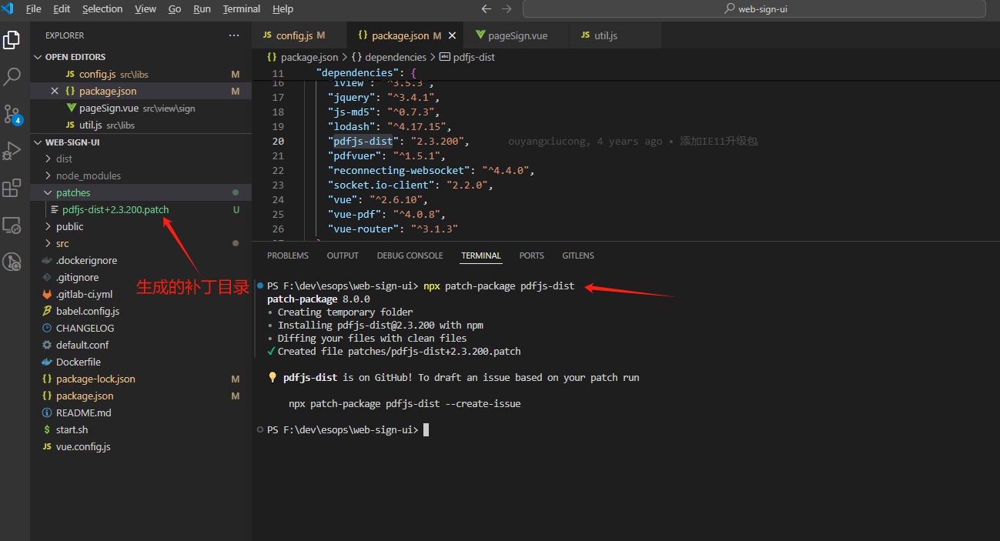

# patch-package使用方法
#### 简介：patch-package 允许应用程序作者立即修复并保留对 npm 依赖项的修复。对于我们这些代码最前沿的人来说，这是一个重要的修复方式
```
# 修改依赖文件（修复里面的bug）
vim node_modules/some-package/brokenFile.js

# 执行脚本（脚本执行后会生成一个.patch文件夹）
npx patch-package some-package

# git提交.patch文件夹，用来和团队共享这个修复文件
git add patches/some-package+3.14.15.patch
git commit -m "fix brokenFile.js in some-package"
```
准备工作  
package.json
```
"scripts": {
  "postinstall": "patch-package"
}
```
NPM
```
npm i patch-package --save-dev
```
使用步骤
- 修改node_modules下面特定包里面的源代码
- ``` npx patch-package package-name ```  
如果这是您第一次使用 patch-package，它将在应用程序的根目录中创建一个名为 patch 的文件夹。 里面会有一个名为 package-name 0.44.0.patch 之类的文件，这是普通旧包名和固定版本之间的差异。 提交此信息以与您的团队共享修复程序
- git提交 patches文件  

